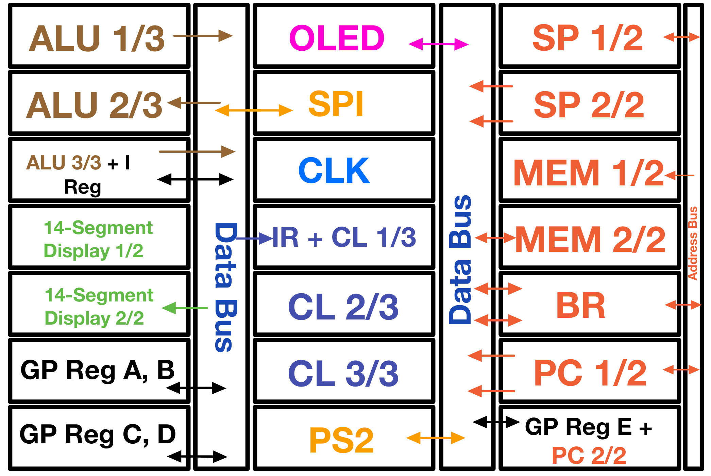
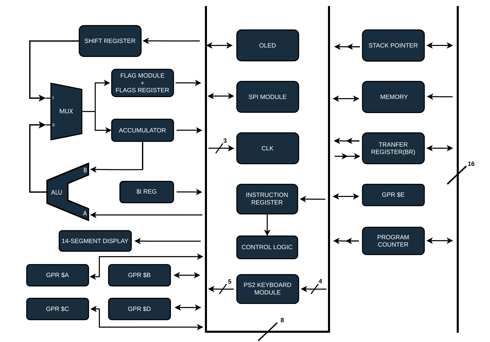

# F8-BB: Expanded 8-bit Breadboard CPU

F8-BB is my expanded 8-bit breadboard CPU. The project is inspired by [Ben Eater's 8-bit CPU series](https://www.youtube.com/playlist?list=PLowKtXNTBypGqImE405J2565dvjafglHU), but it has grown into a larger custom machine with a 16-bit address space and additional I/O hardware.

The goal of this repository is to collect the files needed to document, program, and maintain the build.


## Project status

The CPU is functional and already runs Fibonacci and display demos. The current development focuses on the SD-card loader, OLED text/monitor work, and the software structure needed for a small monitor-like environment.

## Acknowledgment

A huge thank you to [Ben Eater](https://github.com/beneater) for the original educational CPU series that inspired this project.

I also want to thank [DerULF1 / ULF_Casper](https://github.com/DerULF1) for his 8-bit CPU [series](https://www.youtube.com/playlist?list=PL5-Ar_CvItgaP27eT_C7MnCiubkyaEqF0). The interrupt handling and PS/2 keyboard module in my build are largely derived from his design.

## Hardware highlights

- 8-bit data bus
- 16-bit memory/system bus
- 16-bit Program Counter
- 16-bit Stack Pointer
- Bridge Register for transfers between the 8-bit data bus and 16-bit memory/system bus
- 48 KB of RAM from `0x0000` through `0xBFFF`
- Bootloader ROM window starting at `0xC000`
- Stack initialized at `0xBFFF` and growing downward into RAM
- Programmable clock speed with eight selectable clock rates
- Microcoded control unit built from three M27C4002 EPROMs
- Generated 48-bit control word split across three 16-bit ROM outputs
- General-purpose registers A, B, C, D, and E
- Writable flags and interrupt-related control state
- ALU operations including ADD, SUB, AND, OR, XOR, compare, and shifts
- 16-bit 14-segment display output
- 128x64 OLED display
- SPI/SD-card interface work
- PS/2 keyboard decoder integration planned for the monitor/OS path



## Repository layout

```text
ASM/
    Assembly source files.

ASM/boot/
    ROM bootstrap programs, including SD-card bootloader code.

ASM/drivers/
    Hardware-facing assembly libraries, including OLED and SPI/SD routines.

ASM/libs/
    Shared assembly helpers such as timing routines.

ASM/programs/
    Early standalone demo programs such as Fibonacci, bounce, OLED demos,
    and display tests.

ASM/ruledef.asm
    Generated CustomASM rule definitions for the current instruction set.

generated/
    Generated files produced by project tools.

generated/microcode/
    Generated instruction documentation and microcode ROM images.

tools/microcode/
    Python microcode generator used to create rule definitions,
    instruction documentation, and the three microcode ROM binaries.

tools/deployment/
    Scripts for assembling, packaging, writing, and verifying ROM/SD payloads.

generated/display_rom/
    Generated binary image for the 14-segment display ROM.

tools/display_rom/
    Generator for the 14-segment display ROM.

tools/oled/
    OLED-related generator scripts, including the 5x7 text library generator.

EEPROM Programmer/
    Arduino-based EEPROM programmer material used earlier in the project.

Schematics & Figures/
    Hardware schematics, diagrams, and exported figures.

datasheets/
    Datasheets for ICs and modules used in the build.

images/
    Project photos and overview diagrams.
```


## Microcode and generated files

The current microcode source lives here:

```text
tools/microcode/microcode_generator.py
```

It generates:

```text
ASM/ruledef.asm
generated/microcode/instructions.md
generated/microcode/microcode_rom_0.bin
generated/microcode/microcode_rom_1.bin
generated/microcode/microcode_rom_2.bin
```

`ASM/ruledef.asm` is used by CustomASM programs. The generated instruction reference and ROM binaries are placed under `generated/microcode/`.

## Deployment tools

tools/deployment/
    Scripts for assembling, packaging, writing, and verifying ROM/SD payloads.

The deployment tools live here:

```text
tools/deployment/
```

Current tools include:

```text
deploy_asm.py
make_bootdesc.py
compare_binary.py
```

`deploy_asm.py` assembles CustomASM programs and prepares either ROM payloads or SD-card payloads. It can also create BT1 multi-sector SD payloads and write/read back data from a raw SD block device.

`make_bootdesc.py` creates standalone BT1 boot descriptor sectors.

`compare_binary.py` compares two binary files byte-for-byte and reports whether they match.

## Assembly files

The `ASM/` directory is split between boot code, reusable drivers, shared helpers, and standalone programs.

Current public assembly areas include:

```text
ASM/boot/
    SD-card ROM bootstrap programs.

ASM/drivers/oled/
    Basic OLED constants and low-level display routines.

ASM/drivers/spi_sd/
    SPI and SD-card routines used by the bootloader and future monitor work.

ASM/libs/
    Shared helper routines.

ASM/programs/
    Early demo programs.

## Architecture



More detailed explanations are available on the project blog:

```text
https://fadil-1.github.io/blog/8-bit_breadboard_CPU/overview/
```

## License

This repository uses separate licenses for software, hardware design material, and documentation/images. See `LICENSE.md` and the `LICENSES/` directory for details.